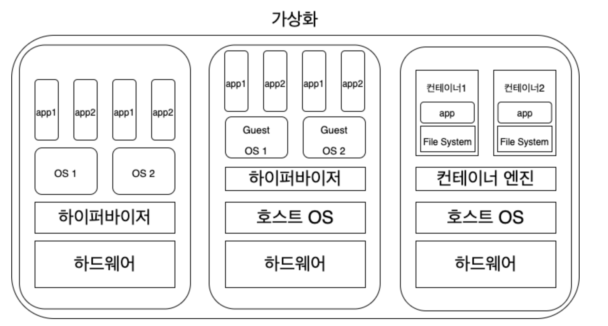

# Table of Contents
- [Table of Contents](#table-of-contents)
- [Inception](#inception)
- [1. Alpine Linux](#1-alpine-linux)
- [2. Virtualization](#2-virtualization)
		- [가상화란?](#가상화란)
		- [가상화 종류](#가상화-종류)
- [3. Container](#3-container)
- [4. Docker](#4-docker)
	- [Docker?](#docker)
	- [Docker Architecture](#docker-architecture)
	- [Docker Daemon (`dockerd`)](#docker-daemon-dockerd)
	- [Docker Client (`docker`)](#docker-client-docker)
	- [Docker Registries](#docker-registries)
	- [Docker Objects](#docker-objects)
		- [**Images**](#images)
		- [**Containers**](#containers)
		- [Networks](#networks)
		- [Volumes](#volumes)
		- [Plugins](#plugins)
	- [Storage Driver](#storage-driver)
		- [Docker Image Layer](#docker-image-layer)
		- [Docker Container Layer](#docker-container-layer)
	- [PID 1 (`init system`) in Docker](#pid-1-init-system-in-docker)

# Inception 
- Summary: This document is a System Administration related exercise.
- Version: 1

# 1. Alpine Linux

- **리눅스 커널을 기반으로 한 리눅스 배포판**
- **“Small. Simple. Secure.”**
- 타 리눅스 배포판보다 훨씬 가볍고 깔끔한 것이 장점 → 컨테이너에 흔히 사용됨
    
    [왜 컨테이너 환경에서는 Alpine Linux가 선호될까?](https://velog.io/@dry8r3ad/why-alpine-linux)
    
- **가벼운 용량 (Small)**
    - 가벼운 용량을 컨셉으로 잡은 덕분에 패키지 하나하나의 용량이 매우 작고 기본적으로 man 문서를 분리하여 용량에서 더 많은 이점을 가져갔다고 볼 수 있음
    - `Glibc` 아닌 `Musl` 을 사용하여 더더욱 임베디드에서 가볍게 동작
        - `Musl` : C 라이브러리 `Glibc` 대신 사용. 크기, 정확도, 정적 링킹 지원 등의 장점
    - `BusyBox` 기반으로 단일 바이너리 용량 줄임
        - `BusyBox` : 여러 유닉스 도구(ls, cd)을 한 실행파일로 제공하는 소프트웨어 → 용량 측면에서 이점
    
    ⇒ **클라우드 환경에서 용량은 큰 장점으로 작용**
    
    ⇒ AWS, Azure의 Public Cloud에서 제공하는 서비스를 사용하는 경우, **사용량에 따라서 비용 발생 → 컨테이너 환경에서는 지속적인 배포하고 여러 이미지를 받음**
    
    ⇒ 이 과정에서 네트워크 자원을 사용량 줄여야 함
    
    ⇒ But! 이런 요소들이 기존 배포판과 달라서 문제 해결에 어려움
    
- *Docker가 호스트 운영체제의 커널 위에 격리를 시켜주는 반가상화 시스템?*
- **Secure**
    - 알파인 리눅스에서 제공되는 모든 유저 레벨의 바이너리들은 PIE(Position Independent Executables)로 컴파일 되어 Stack Smashing Protection 되어있다.
    - 또한 가벼운 OS를 지향하는 만큼 기본적으로 설치되어 있는 프로그램이 적음
    - 그만큼 취약점 생길 포인트가 적음 (안전)
    - `PIE` : 리눅스 환경에서의 메모리 보호 기법
    - *실제로 2014년, `ShellShock` 취약점이 발견되었고 공격 대상이 되었던 Bash가 기본적으로 설치되어 있던 대부분의 리눅스 배포판은 이 취약점의 영향을 받았지만 Bash를 기본으로 설치하지 않은 알파인 리눅스는 영향이 없었음*
- `init system`으로 `openRC` 사용함
    - `init system`
        - PID 1인, 커널을 시작할 때 실행되는 첫 번째 프로세스. 좀비 프로세스 관리
        - ex) `systemd` , `openRC`
    

# 2. Virtualization

### 가상화란?

### 가상화 종류

- 베어메탈
    - ex) 멀티 부팅
- 호스트형 가상머신
    - ex) Virtual Box, VM ware
- **컨테이너**
    - ex) Docker

# 3. Container

- **VM과 달리, 호스트 커널 공유하면서 프로세스를 격리된 환경에서 실행하는 기술**
- 커널을 공유하는 방식이기 때문에 **실행 속도가 빠르고, 성능 손실 X**
- 커널을 공유하지만, 커널 기능(ex. namespace)을 활용해 격리(독립)
    
    → 호스트 OS 관점에서는 프로세스로 보이나 내부 들여다 보면 하나의 가상환경
    
- 가상화 기술의 종류

# 4. Docker
## Docker?
- 애플리케이션 개발, 배포, 실행을 위한 오픈 플랫폼
- 컨테이너를 실행하고 관리할 수 있도록 도와주는 도구
- 컨테이너는 가볍고 애플리케이션을 실행하는 데 필요한 모든 것을 포함하므로 호스트에 현재 설치된 항목에 의존할 필요 없음
- 이전의 컨테이너 기술에서는 컨테이너의 환경을 완전하고 효율적으로 복원하는 것이 상당히 어려운 일이었음
    
    → 도커는 파일을 계층으로 나눠서 저장할 수 있는 `union mount` 기술과 `Docker Hub`라는 원격 저장소를 기본적으로 제공함으로써 이 문제를 해결함
    
    → `Docker Images`는 도커의 간편한 인터페이스와 더불어 도커가 성공적으로 자리잡는 데 중요한 역할

## Docker Architecture

- Docker Daemon ↔ Docker Client 통신
    - 동일한 시스템에서 실행 or 클라이언트를 원격 데몬에 연결 가능
    - UNIX 소켓 or 네트워크 인터페이스를 통해 `REST API` 사용하여 통신

## Docker Daemon (`dockerd`)

- 실제 동작하는 프로세스
- 도커 엔진의 기능을 수행 후 응답하는 프로세스
- API 요청을 수신하고 이미지, 컨테이너, 네트워크 및 볼륨과 같은 도커 객체를 관리

## Docker Client (`docker`)

- 사용자가 Docker와 상호작용하는 기본 방법
- `docker run`과 같은 명령 사용 → 클라이언트가 명령을 API로 `dockerd`로 보내서 실행
- 또다른 도커 클라이언트 is `Docker Compose`

## Docker Registries

- Docker Image 저장소
- 도커는 default로 Docker Hub에서 Image 찾음
- own private registry도 가능

## Docker Objects

### **Images**

- 컨테이너를 빌드하기 위한 read-only 바이너리 파일
- 이미지 pull 커맨드 : `docker pull <IMAGE>`
    - `<IMAGE>` : `<NAMESPACE>/<IMAGE_NAME>:<TAG>` 꼴을 레지스트리에서 내부적으로 파싱되어 사용됨
    - `<NAMESPACE>` 앞에는 도메인이 들어갈 수 있는데 도커 이미지 저장소의 주소를 가리킴
        
        → default가 `Docker Hub` (docker.io)
        
    - ex) `docker.io/library/ningx:latest`
- I**mage 원리(저장 방식) : [Docker Image Layer](#docker-image-layer)**

### **Containers**

- 실행가능한 이미지의 인스턴스
- 사용자는 컨테이너를 Docker API를 통해 생성, 삭제 수정, 이동

### Networks

### Volumes

- 컨테이너에서 생성되고 사용되는 데이터를 유지하기 위해 선호되는 메커니즘
- 컨테이너와 관련된 특별한 유형의 디렉터리
- 모든 데이터 유형을 저장할 수 있음 (코드, 로그 파일 등)
- 컨테이너 간에 데이터 공유 가능
- 이미지가 업데이트 될 때 데이터 볼륨에 영향 X → 컨테이너가 컴퓨터에서 삭제된 경우에도 데이터 볼륨은 남아서 여전히 제어 가능
- `bind mount`는 호스트 시스템의 디렉토리 구조와 OS에 따라 다르지만 `Volumes`은 도커에서 완전히 관리함
    - `volumes` VS `bind mount`
        
        ### Volumes
        
        
        
        > volumes (출처 : docker 공식 문서 [Use volumes](https://docs.docker.com/storage/volumes/))
        
        - `volumes`가 `bind mount` 보다 백업 또는 마이그레이션이 쉬움
        - Docker CLI command 또는 Docker API 사용하여 `Volumes` 관리
        - `Volumes`는 Linux, Windows 컨테이너 모두에서 작동함
        - 여러 컨테이너 간에 `Volumes`을 보다 안전하게 공유할 수 있음
        - `Volumes` 드라이버를 사용하면 원격 호스트 또는 클라우드 제공자에 `Volumes`을 저장하거나 `Volumes`의 내용을 암호화하거나 다른 기능을 추가할 수 있음
        - 새 `Volumes`는 컨테이너에 의해 미리 채워진 콘텐츠를 가질 수 있음
        - Docker Desktop의 `Volumes`는 Mac, Windows 호스트의 `bind mount`보다 훨씬 높은 성능 제공
        
        ### bind mount
        
        
        
        > bind mount (출처 : docker 공식 문서 [Use bind mounts](https://docs.docker.com/storage/bind-mounts/))
        
        - Docker 초기부터 사용됨
        - `Volumes`에 비해 기능 제한
        - 호스트 시스템의 파일 또는 디렉토리가 컨테이너에 마운트 됨
- [`Storage Driver`](#storage-driver) VS `Volumes`

### Plugins

 

## Storage Driver

- Docker는 Storage Driver를 사용하여 **Image Layer를 저장**하고 **컨테이너의 쓰기 가능한 layer에 데이터를 저장**
- 각 Layer가 서로 상호 작용하는 방식에 대한 세부 정보를 처리함
- Storage Driver은 공간 효율성에 최적화
- But! 쓰기는 copy-on-write file system을 사용 -> 기본 file system 성능보다 쓰기 속도가 느림
    
    **⇒ 컨테이너의 쓰기 가능한 계층은 런타임 시 생성되는 임시 데이터를 저장하는 데 적합**
    
- Database Storage 같은 쓰기 집약적인 애플리케이션은 특히 기존 데이터가 read only 계층에 있는 경우 성능 오버헤드의 영향 받음
    
    ⇒ 쓰기 집약적인 데이터, 컨테이너의 수명을 넘어 지속되어야 하는 데이터 및 컨테이너 간에 공유 되어야 하는 데이터는 [`Docker Volumes`](#volumes) 사용!
    
- `docker info | grep "Storage Dirver"`로 확인 가능
    - 현재는 지원되는 모든 Linux 배포판에서 선호하는 스토리지 드라이버는  `overlay2` (추가 구성 필요 없음) - 2022년 11월 기준
- 다양한 Storage Driver를 사용할 수 있으며 상황에 따라 장점, 단점이 있음
- **효율적으로 Storage Driver를 사용하려면,** Docker가 **이미지를 build하고 저장하는 방법**과 **컨테이너에서 이러한 이미지를 사용하는 방법**을 알아야 함!
    
    ⇒ [Docker Image Layer](#docker-image-layer), [Docker Container Layer](#docker-container-layer)
    
- [Docker storage drivers 공식 문서](https://docs.docker.com/storage/storagedriver/select-storage-driver/)

- [About storage drivers 공식 문서](https://docs.docker.com/storage/storagedriver/)

### Docker Image Layer

- Docker image는 일련의 `layer`로 구성
- 도커 이미지를 구성하는 각 파일을 `layer`라고 함 (분리된 데이터)
- 이러한 계층은 일련의 중간 이미지를 형성, 각 계층이 바로 아래의 계층에 종속됨
- file system을 수정하는 명령은 계층을 생성함
    - `FROM`, `COPY`, `RUN` : layer 생성
    - `LABEL`, `CMD` : image의 metadata 수정 → layer 생성 X
- 각 layer는 이전의 layer과의 차이의 set임
- file을 추가, 삭제하는 것은 new layer로 생성됨 → 삭제되어도 이전 layer에서 계속 사용할 수 있으며 images의  total size는 늘어남
- 이미지가 컨테이너로 실행되면 맨 위에 쓰기 가능한 layer가 추가됨 → [`Container Layer`](#docker-container-layer)

### Docker Container Layer

- 도커 컨테이너가 실행되면 모든 읽기 전용 레이어(`Read Only Layer`)들은 순서대로 쌓은 다음 마지막에 쓰기 가능한 신규 레이어를 추가
- 그 다음 컨테이너 안에서 발생하는 결과물들이 쓰기 가능 레이어(`Read-Write Layer`)를 기록
- 아무리 많은 도커 컨테이너를 실행하더라도 기존 읽기 전용 레이어는 변하지 않고, 컨테이너마다 생성된 쓰기 가능한 레이어에 데이터가 쌓이기 때문에 서로 겹치지 않으며 컨테이너가 종료되면 모두 사라짐

## PID 1 (`init system`) in Docker

- 리눅스 커널의 PID와 마찬가지로 컨테이너에서 실행된 첫 번째 프로세스는 PID 1을 얻는다
- PID 1로 등록된 단 하나의 프로세스만을 컨테이너가 담당하겠다는 의미
- 단 하나의 컨테이너가 곧 단 하나의 서비스(프로세스)를 의미 → 서버 환경 관리 측면에서 일관성
- 분리된 좀비 프로세스를 제거하는 데에 사용됨
    - 분리된 프로세스 (상위 요소가 사라진 프로세스)는 PID 1이 있는 프로세스에 다시 첨부됨
    - 그러나 컨테이너에서는 PID 1을 갖고 있는 프로세스가 이러한 책임
    - 제대로 제거를 하지 못하면 메모리나 다른 리소스가 부족해질 수 있음
